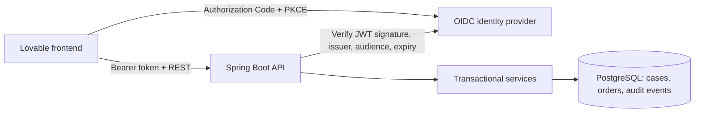

# Order Case Platform

A service fulfillment application built with Java 17, Spring Boot, and PostgreSQL.
Operators open customer cases, create provisioning orders, progress their work,
and close the case with an attributable activity history. Viewers have read-only
access. The [frontend](https://github.com/haochen8/frontend-order-case-platform)
is implemented, and its core workflow has been verified locally against Keycloak,
Spring and PostgreSQL. See [live integration results](docs/live-integration-verification.md).
Public deployment remains planned.

## Run locally

Requires Docker Compose. From the repository root:

```bash
docker compose up --build -d
```

The API runs at `http://localhost:8080`; local Keycloak runs at
`http://localhost:9090`. Wait for `http://localhost:8080/actuator/health` and the
Keycloak realm to become available. Compose binds exposed ports to loopback.
The bundled identity users and passwords are **local fixtures**, not production
credentials. Do not deploy this Compose configuration publicly.

For a local API exercise, obtain an operator token (requires Python 3):

```bash
TOKEN=$(curl --fail --silent --show-error \
  http://localhost:9090/realms/case-platform/protocol/openid-connect/token \
  -d grant_type=password -d client_id=case-platform-cli \
  -d username=operator -d password=operator-local-only \
  | python3 -c 'import json,sys; print(json.load(sys.stdin)["access_token"])')
curl --fail-with-body http://localhost:8080/api/cases \
  -H "Authorization: Bearer $TOKEN" -H 'Content-Type: application/json' \
  -d '{"title":"Provision fiber connection","description":"Install service at a new address"}'
```

The local viewer account is `viewer` / `viewer-local-only`. The password grant
client exists only for local command-line exercises. The web client uses
Authorization Code with PKCE. API documentation is available at `/v3/api-docs`
with a bearer token. Swagger UI also requires authentication.

Once both services are ready, `python3 scripts/smoke_api.py` exercises real
signed-token authentication, permissions, the full workflow, conflicts, history,
and OpenAPI. It creates one closed fictional case per run in the local database.

Business data survives `docker compose down`. Local identity data is disposable
and recreated from `dev/keycloak-realm.json`. Do not remove the database volume
unless you intend to discard its data.

## Verify

```bash
cd backend-spring
GRADLE_USER_HOME=../.gradle-home ./gradlew test
GRADLE_USER_HOME=../.gradle-home ./gradlew integrationTest
GRADLE_USER_HOME=../.gradle-home ./gradlew check bootJar
```

`test` runs fast H2 API/regression tests. `integrationTest` starts PostgreSQL 16,
executes the actual Flyway migration, validates the JPA schema, and checks the
same API contract plus database constraints. Docker is mandatory for this task;
it fails rather than silently skipping. `check` runs both suites. GitHub Actions
runs `check bootJar` on pushes and pull requests and retains test reports.

## Architecture



- Database foreign keys protect orders from orphaning.
- Case and order changes use versions; stale writes receive HTTP 409.
- A case row lock serializes case/order mutations to preserve workflow rules.
- Audit events participate in the business transaction and survive case deletion.
- `VIEWER` can read; `OPERATOR` can read and write. JWT subjects identify actors.
- Flyway owns schema evolution; Hibernate only validates outside fast tests.

Read [workflow and API contract](docs/api-contract.md),
[architecture decisions](docs/architecture.md),
[verification results](docs/verification.md),
[delivery milestones](docs/roadmap.md), and
[agent instructions](AGENTS.md).

## Existing databases

V1 initializes a **new, empty** database. Existing databases previously managed
by Hibernate `ddl-auto=update` need a reviewed migration plan and backup. This
project deliberately does not auto-baseline an unknown schema or delete data.
Use a new development database/volume when evaluating this foundation.

## Deployment prerequisites

The backend is a non-root Docker image. Configure database credentials,
`JWT_ISSUER_URI`, `JWT_JWK_SET_URI`, and an explicit comma-separated
`CORS_ALLOWED_ORIGINS` list. Issue tokens with audience `case-platform-api`, a
stable subject, an expiration, and a top-level `roles` array containing `VIEWER`
or `OPERATOR`. Use HTTPS and a properly operated OIDC provider; the development
realm is not a production identity setup. An empty roles list grants no access.

A portable release configuration, private input generator, backup script and
step-by-step [deployment runbook](docs/deployment.md) are now available. These use
production Keycloak with persistent identity storage and HTTPS ingress. Public
deployment, hosted smoke checks, image scanning and the demo data policy remain
release gates; no public environment is claimed to be live.
